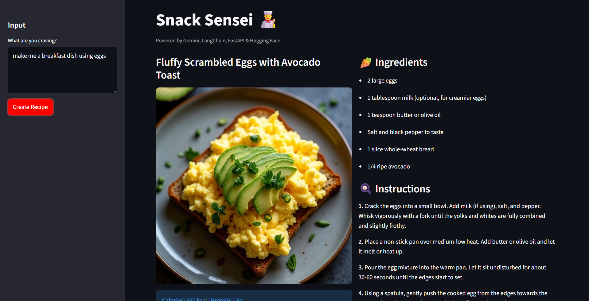
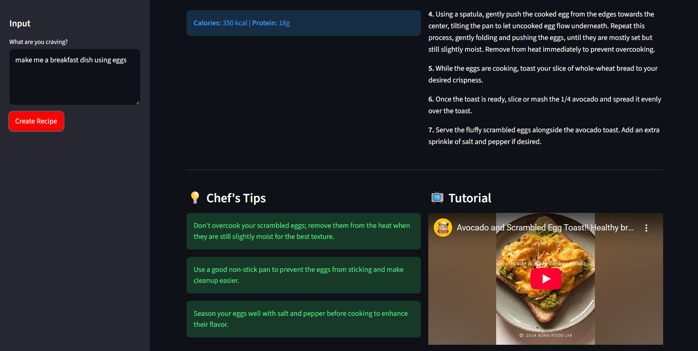

#  Snack Sensei - AI-Powered Recipe Generator

**Snack Sensei** is a full-stack GenAI application that generates detailed recipes, nutritional info, realistic dish images, and video tutorials based on user ingredients or cravings.

It uses a **Microservices Architecture** to separate the reasoning logic (Backend) from the user interface (Frontend).

##  Live Demo
- **Frontend UI (Render):** [https://snack-sensei-ui.onrender.com](https://snack-sensei-ui.onrender.com)
- **Backend API (Hugging Face):** [https://huggingface.co/spaces/AIViralX/Snack-Sensei-Backend](https://huggingface.co/spaces/AIViralX/Snack-Sensei-Backend)

---

##  App Previews

> *The application generates realistic food images using the Flux.1-dev model via Hugging Face Inference.*

---

##  System Workflow

The application follows a **Client-Server** pattern designed for robustness:

1.  **User Interaction:** The user inputs ingredients or a craving into the **Streamlit Frontend**.
2.  **API Request:** The frontend sends a payload to the **FastAPI Backend**.
3.  **AI Orchestration (LangChain):**
    * **Logic Agent:** Calls **Google Gemini 2.5 Flash** to generate the recipe, enforcing a strict JSON schema for consistent parsing.
    * **Vision Agent:** Sends a prompt to **Hugging Face (Flux.1-dev)** to generate a hyper-realistic image of the described dish.
    * **Search Agent:** Queries the **YouTube Data API** to find the most relevant cooking tutorial.
4.  **Response Assembly:** The backend aggregates text, image bytes, and video metadata into a single JSON response.
5.  **Rendering:** The frontend renders the structured data into an interactive UI.

---

##  Tech Stack

| Category | Technologies |
| :--- | :--- |
| **Frontend** | Python, Streamlit, Requests |
| **Backend** | Python, FastAPI, Uvicorn, Pydantic |
| **AI & LLM** | LangChain, Google Gemini API, Hugging Face Inference API (Flux) |
| **External APIs** | YouTube Data API v3 |
| **DevOps** | Docker, Docker Compose, Git |
| **Cloud** | Render (Frontend), Hugging Face Spaces (Backend) |

---
 ## License
This project is licensed under the [MIT](https://github.com/AviralMishra039/SnackSensei/blob/main/LICENSE) License
